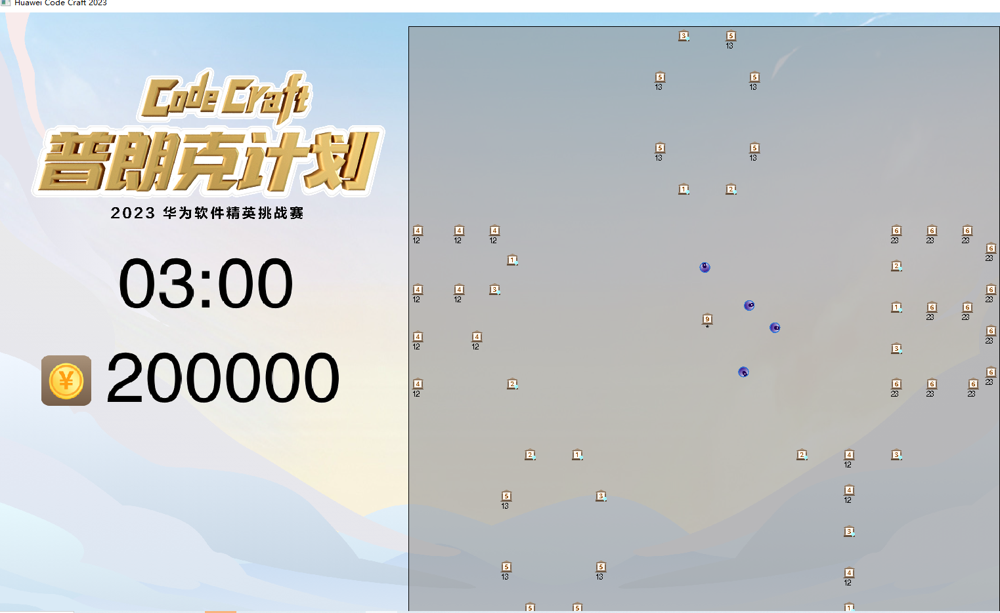

# 1、简要概述

[这是2023华为软件精英挑战赛 ](https://competition.huaweicloud.com/advance/1000041868/introduction)初赛阶段319万分的代码，粤港澳区排名第8。该比赛要求选手在一个50m*50m的地图上，控制4台机器人前进、后退或者旋转，去分布在地图上的各种类型的工作台购买或者出售商品，赚取差价，以取得收益最大化为目标。

# 2、快速运行

因为需要UI展示界面，去演示控制机器人行动的过程，所以代码是在windows平台下进行开发的。

1. 拉取代码文件。

   ```git
   git clone https://github.com/2563347014/HuaWeiSoftwareChallenge2023.git
   ```

2. 编译器打开代码文件。

3. 运行run.py文件即可，将会弹出一个窗口去展示机器人的行动过程。


